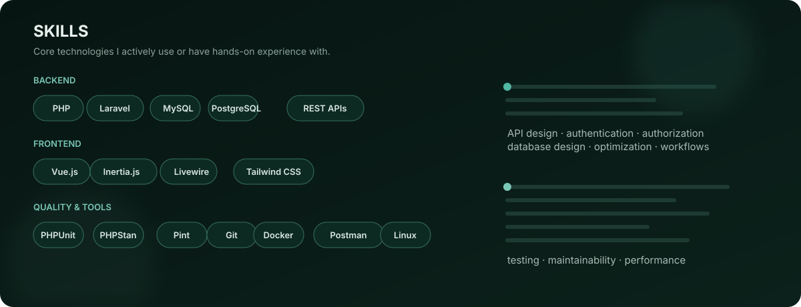

  <a href="https://julynardtago-on.netlify.app/">Portfolio</a> ·
  <a href="https://github.com/Julynard">GitHub</a>

## About

I am a full-stack engineer focused on building software that is **clear, maintainable, and useful to the business**.

My strongest area is the Laravel/PHP ecosystem, with experience across application and API development, relational database design, authentication and authorization, business workflows, Vue/Inertia/Livewire frontends, testing, and performance.

## Skills

## Selected Work

| Project | What it demonstrates |
| --- | --- |
| [User Management CRUD](https://github.com/Julynard/technical-task-simple-user-management-crud) | Laravel 12, Vue 3, Inertia, Sanctum, REST API, validation, services, repositories, search, pagination, soft deletes |
| [Laravel Livewire](https://github.com/Julynard/livewire) | Laravel 12, Livewire 4, component-driven UI, testing, and code quality |
| [Auth API / ITEXMO](https://github.com/Julynard/auth-api-itexmo) | Laravel API, Sanctum authentication, Vue frontend, external messaging integration |
| [Ordering System](https://github.com/Julynard/ordering-system) | Laravel business-domain application with ordering workflows and administration |

## Current Focus

### Production Laravel API

A multi-tenant API demonstrating authentication, authorization, database design, transactions, API contracts, testing, and maintainable architecture.

### Business Workflow System

A realistic workflow application demonstrating approvals, permissions, notifications, queues, audit history, and failure handling.

### Laravel Performance Project

A measurable performance case study covering database indexing, query optimization, caching, pagination, profiling, and before/after benchmarks.

> The goal is not to accumulate repositories. It is to build a small number of projects that demonstrate engineering judgment.

## Engineering Principles

**Solve the business problem first**  
Architecture should support the domain instead of adding abstraction for its own sake.

**Make decisions explicit**  
Important design choices should explain the problem, the chosen approach, and the trade-off.

**Measure before optimizing**  
Performance work should start with evidence: query analysis, profiling, benchmarks, and measurable results.

**Test behavior, not implementation details**  
Tests should protect business behavior, authorization, validation, API contracts, and important failure paths.

**Keep systems understandable**  
Good engineering is not about having the most layers. It is about having boundaries that make a system easier to change safely.

## GitHub Stats

**Private contributions:** GitHub's own profile contribution graph can show private contributions without exposing private repository names or code when private contribution visibility is enabled. The third-party stats cards above use publicly accessible profile data.

## Achievements

I currently have **no major public GitHub achievements or open-source recognition** to feature prominently.

I would rather leave this section honest than manufacture credibility. The goal is to earn this section through real contributions, packages, stars, merged PRs, and useful public software.

## Portfolio

**Website:** [julynardtago-on.netlify.app](https://julynardtago-on.netlify.app/)

**GitHub:** [github.com/Julynard](https://github.com/Julynard)

---

**Build. Measure. Improve.**

