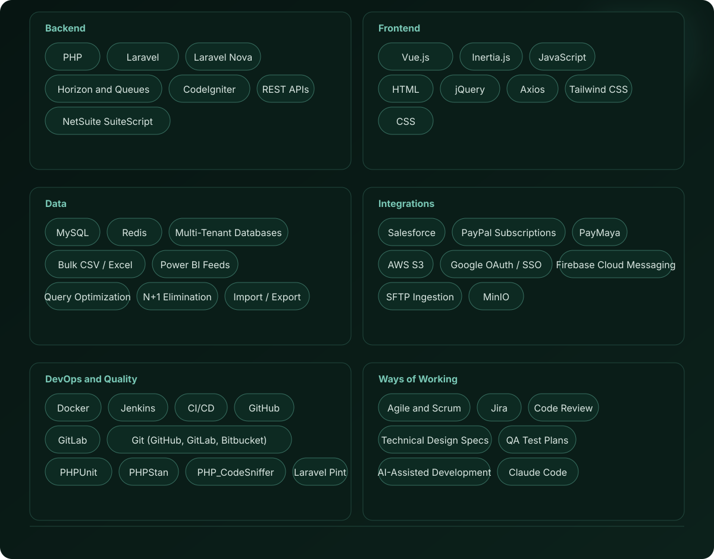
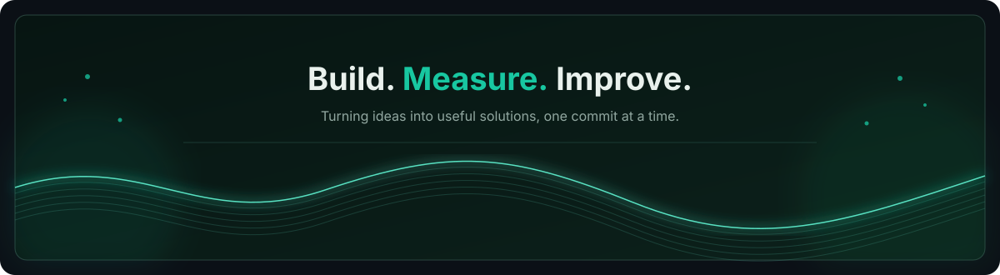

  
  
  

## About

I am a full-stack engineer focused on building software that is **clear, maintainable, and useful to the business**.

My strongest area is the Laravel/PHP ecosystem, with experience across application and API development, relational database design, authentication and authorization, business workflows, Vue/Inertia/Livewire frontends, testing, and performance.

## Skills

Core technologies actively used or hands-on experience.

## GitHub Stats

**Private contributions:** GitHub's own profile contribution graph can show private contributions without exposing private repository names or code when private contribution visibility is enabled. The third-party stats cards above use publicly accessible profile data.

## Portfolio

**Website:** [julynardtago-on.netlify.app](https://julynardtago-on.netlify.app/)

**GitHub:** [github.com/Julynard](https://github.com/Julynard)

